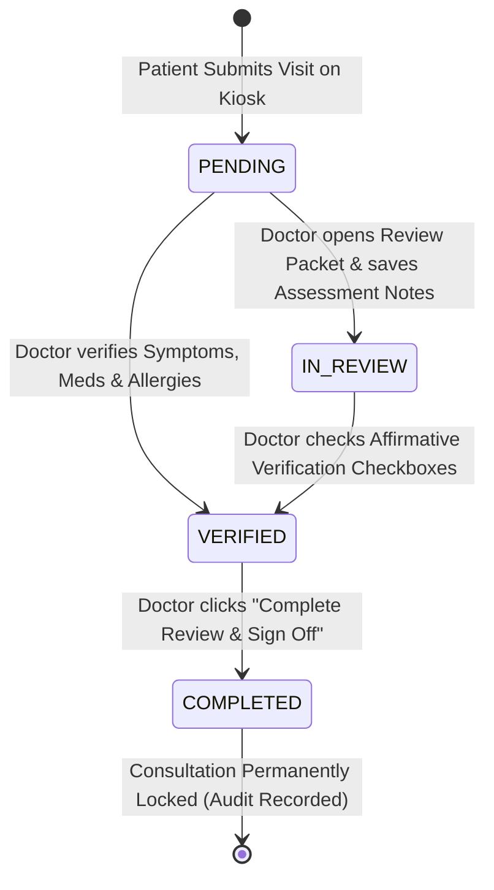
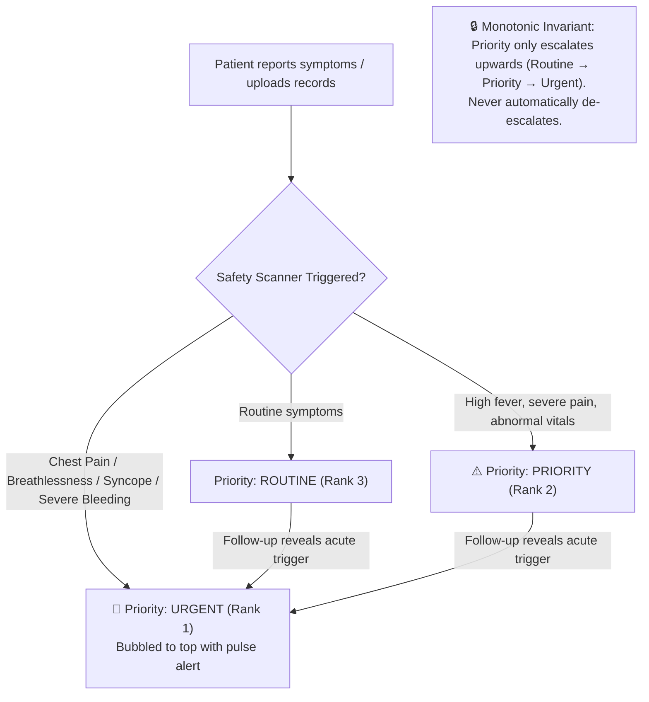
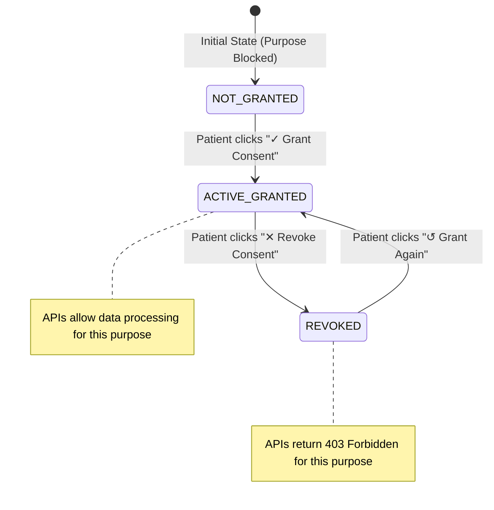

# MediKiosk

An AI-assisted, multilingual self-service clinical intake kiosk for hospital Outpatient Departments (OPD). It enables patients to record their symptoms and upload previous medical records before their consultation, while providing attending physicians with a structured, source-traceable review workspace.

[](https://www.sih.gov.in/)
[](https://fastapi.tiangolo.com/)
[](https://www.postgresql.org/)
[](tests/)
[](app/services/fhir_service.py)
[](app/services/ayush_coding_service.py)

---

## 1. Overview & Core Architecture Tree

In high-volume hospital Outpatient Departments (OPDs), physicians often have only a few minutes per consultation. Patients arrive with fragmented paper prescriptions, diverse language backgrounds, and unstructured symptoms. 

**MediKiosk** acts as a pre-consultation intake station placed at the hospital OPD entrance. It guides patients through identity lookup, purpose-specific consent, multilingual voice history-taking, and medical document digitization (via file upload or camera snapshot). The attending clinician then receives an organized clinical review packet with source-backed findings, unverified-state safeguards, emergency triage alerts, and interoperable FHIR/AYUSH representations.

### End-to-End System Tree Diagram

```mermaid
graph TD
    Root["🏥 MediKiosk Hospital System"]
    
    %% Patient Flow Branch
    Root --> PK["🖥️ Patient Kiosk Station (Frontend UI)"]
    PK --> PK1["1. Language & i18n (22 Scheduled Languages)"]
    PK --> PK2["2. Identification (Lookup / Demographics / ABHA)"]
    PK --> PK3["3. Granular 3-State Consent Gate (6 Scopes)"]
    PK --> PK4["4. Voice Intake (Groq Whisper + Patient Verify)"]
    PK --> PK5["5. Document Digitization (Upload / Camera Scan)"]
    PK --> PK6["6. Summary Synthesis & Submission"]
    
    %% Backend Core Branch
    Root --> BE["⚡ FastAPI Backend Engine (Port 8001)"]
    BE --> BE_API["API Route Controllers"]
    BE_API --> API_P["/patients (Demographics & ABDM)"]
    BE_API --> API_C["/consents (3-State Engine)"]
    BE_API --> API_I["/intake (STT & Clinical Dialogue)"]
    BE_API --> API_D["/documents (Upload, OCR & Extraction)"]
    BE_API --> API_R["/physician_review (Queue & Sign-off)"]
    BE_API --> API_O["/fhir & /ayush-coding (Interoperability)"]
    
    BE --> BE_SVC["Micro-Services & AI Pipeline"]
    BE_SVC --> SVC_STT["Groq Whisper Turbo (Multilingual STT)"]
    BE_SVC --> SVC_LLM["Groq GPT OSS 120B (Clinical Reasoning)"]
    BE_SVC --> SVC_OCR["NVIDIA Nemotron OCR v2 (Vision OCR)"]
    BE_SVC --> SVC_EXT["Structured Medical Extractor"]
    BE_SVC --> SVC_AYU["AYUSH NAMASTE + WHO ICD-11 TM2 Engine"]
    BE_SVC --> SVC_FHI["NRCES India FHIR R4 Bundle Builder"]
    BE_SVC --> SVC_TRG["Monotonic Emergency Red-Flag Triage"]
    
    %% Doctor Flow Branch
    Root --> PW["🩺 Physician Clinical Workspace"]
    PW --> PW1["1. Priority Triage Queue (Urgent 🚨 / Priority ⚠️ / Routine)"]
    PW --> PW2["2. Source-Backed Review Packet (Demographics, Symptoms, OCR, Labs)"]
    PW --> PW3["3. Interoperability Hub (FHIR R4 Export + AYUSH Card)"]
    PW --> PW4["4. Clinical Notes & Affirmative Verification Checkboxes"]
    PW --> PW5["5. Cryptographic Review Sign-Off & Record Locking"]

    %% Persistence
    BE --> DB[("🗄️ Relational Database & File Storage\nPostgreSQL / Local SQLite + /storage")]
```



---

## 2. Codebase & Directory Tree Diagram

Below is the complete file and component tree diagram showing the responsibilities of each module:

```
medikiosk-backend/
├── app/                                    # Main Application Package
│   ├── api/                                # FastAPI API Route Controllers
│   │   ├── __init__.py
│   │   ├── abdm.py                         # ABHA linking & ABDM consent-gated export
│   │   ├── clinical_summary.py             # Synthesis of clinical summary from encounter
│   │   ├── consent.py                      # 3-state purpose-specific consent lifecycle
│   │   ├── documents.py                    # File/camera upload, OCR execution & extraction
│   │   ├── intake.py                       # Speech-to-text, clinical dialogue & red-flag triage
│   │   ├── patients.py                     # Demographics, AYUSH coding & FHIR R4 endpoints
│   │   └── physician_review.py             # Outpatient queue, notes, verification & sign-off
│   ├── db/                                 # Database Engine & Schema Migration
│   │   └── database.py                     # SQLAlchemy connection, session factory & schema updates
│   ├── models/                             # SQLAlchemy Relational Models
│   │   ├── __init__.py                     # Model exports
│   │   ├── abdm_share_audit.py             # Audit log of ABDM data exports
│   │   ├── allergy.py                      # Patient allergy records & severity
│   │   ├── consent.py                      # Purpose-specific consent status & history
│   │   ├── consultation.py                 # Doctor consultation record, priority & review state
│   │   ├── document.py                     # Uploaded document metadata & storage paths
│   │   ├── encounter.py                    # Pre-consultation intake encounter session
│   │   ├── medication.py                   # Prescriptions, dosage & frequency
│   │   ├── ocr_result.py                   # Raw text, blocks & bounding data
│   │   ├── patient.py                      # Patient demographics & ABHA identifiers
│   │   ├── physician_review_audit.py       # Timestamped affirmative verification trail
│   │   └── symptom.py                      # Discrete symptoms, duration & red-flag signals
│   ├── schemas/                            # Pydantic Schemas (Request/Response Validation)
│   │   ├── ayush_coding.py                 # NAMASTE & WHO ICD-11 TM2 response models
│   │   ├── consent.py                      # Purpose enum & consent grant/revoke models
│   │   ├── medical_extraction.py           # Structured observations, meds & allergies schemas
│   │   ├── patient.py                      # Patient creation & review list models
│   │   └── physician_review.py             # Physician packet, verification & action models
│   ├── services/                           # Core Business Logic & AI Engines
│   │   ├── abdm_service.py                 # ABDM sandbox payload assembly
│   │   ├── ai_service.py                   # Groq GPT OSS 120B clinical reasoning
│   │   ├── ayush_coding_service.py         # Deterministic AYUSH NAMASTE & ICD-11 catalog
│   │   ├── clinical_summary_service.py     # Multi-source clinical summary synthesis
│   │   ├── consent_service.py              # Purpose-specific consent enforcement
│   │   ├── document_intelligence_service.py# Reference range categorization & timeline
│   │   ├── fhir_service.py                 # HL7 FHIR R4 Bundle generator
│   │   ├── medical_extraction_service.py   # Information extraction from OCR text
│   │   ├── ocr_service.py                  # PyPDF rendering & NVIDIA Nemotron OCR client
│   │   ├── physician_review_service.py     # Packet compilation, audit & verification
│   │   └── transcription_service.py        # Groq Whisper speech-to-text integration
│   └── main.py                             # App factory, CORS, routers & frontend static mount
├── frontend/                               # Zero-Build Kiosk & Physician Single Page App
│   ├── app.js                              # UI state engine, i18n, voice, camera & API calls
│   ├── index.html                          # Semantic HTML5 layout, stepper & modal dialogs
│   └── styles.css                          # Clean healthcare design system & responsive layout
├── storage/                                # Local filesystem storage for uploaded medical files
├── tests/                                  # Comprehensive Test Suite (94 Tests Passing)
│   ├── conftest.py                         # Test fixtures & in-memory SQLite isolation
│   ├── test_abdm.py                        # ABDM export & consent gate tests
│   ├── test_ai_service.py                  # Clinical AI conversation tests
│   ├── test_ayush_coding.py                # Deterministic AYUSH mapping tests
│   ├── test_clinical_summary.py            # Summary synthesis tests
│   ├── test_consent.py                     # 3-state consent lifecycle tests
│   ├── test_document_intelligence.py       # Range classification & timeline tests
│   ├── test_documents.py                   # Document upload & validation tests
│   ├── test_end_to_end.py                  # Complete synthetic patient journey test
│   ├── test_fhir.py                        # FHIR R4 Bundle generation tests
│   ├── test_intake.py                      # Intake dialogue & triage tests
│   ├── test_medical_extraction.py          # Structured extraction tests
│   ├── test_ocr.py                         # Document rendering & OCR tests
│   ├── test_patient_consultations.py       # Consultation queue tests
│   ├── test_physician_review.py            # Physician review & sign-off tests
│   ├── test_queue_priority.py              # Monotonic priority escalation tests
│   └── test_transcription.py               # Whisper STT client tests
├── pytest.ini                              # Pytest configuration
├── requirements.txt                        # Python dependencies
├── .env.example                            # Configuration template
└── README.md                               # Project documentation & reference guide
```

---

## 3. State Transition & Lifecycle Trees

### 3.1. Clinical Consultation Lifecycle Tree



### 3.2. Monotonic Priority Triage Tree



### 3.3. 3-State Consent Lifecycle Tree



---

## 4. Step-by-Step: What Is Happening Under the Hood

Here is an exhaustive, technical step-by-step breakdown of every single stage in the MediKiosk workflow from patient arrival to final physician sign-off.

```
┌────────────────────────────────────────────────────────────────────────────────────────┐
│                                PATIENT KIOSK WORKFLOW                                  │
│                                                                                        │
│  [Step 1] ──► [Step 2] ──► [Step 3] ──► [Step 4] ──► [Step 5] ──► [Step 6] ──► [Step 7]│
│  Language     Identity     Consent      Voice Intake  Doc Scan     Summary      Submit │
└───────────────────────────────────────────┬────────────────────────────────────────────┘
                                            │
                                            ▼
┌────────────────────────────────────────────────────────────────────────────────────────┐
│                              PHYSICIAN DESK WORKFLOW                                   │
│                                                                                        │
│         [Step 8] ───────────────► [Step 9] ───────────────► [Step 10]                  │
│       Triage Queue           Review Packet             Clinical Sign-Off               │
│     Priority Sorting        FHIR R4 & AYUSH            Affirmative Locking             │
└────────────────────────────────────────────────────────────────────────────────────────┘
```

---

### Step 1: Language Selection & Multilingual Initialization
- **What Happens in UI**: Patient selects their preferred language from the grid (5 full UI languages + 17 speech-assisted Indian scheduled languages).
- **Under the Hood**:
  1. Frontend sets `state.language = "hi"` (e.g. Hindi) and re-evaluates the localized dictionary `I18N`.
  2. All buttons, labels, accessibility cues, and instructions update dynamically without page reloads.
  3. The language code is attached to all subsequent voice transcription and clinical dialogue requests so the AI assistant speaks and reasons in the chosen language.

---

### Step 2: Patient Identification & Demographics Lookup
- **What Happens in UI**: The patient enters their Patient ID for returning visits or fills a quick registration form (Full Name, Age, Gender, Phone, optional 14-digit ABHA).
- **Under the Hood**:
  1. **Lookup**: Sends `GET /patients/{id}`. If found, retrieves existing medical history, previous encounters, and consent records.
  2. **Registration**: Sends `POST /patients/` with JSON payload `{ name, age, gender, phone, abha_id, language }`.
  3. The database saves a new `Patient` row with a unique autoincrementing ID.
  4. If an ABHA ID is provided, it is normalized and indexed in `patients.abha_id`.

---

### Step 3: Granular 3-State Consent Gate
- **What Happens in UI**: The patient is presented with 6 granular purpose scopes (`clinical_history`, `document_processing`, `document_extraction`, `clinical_summary`, `physician_review`, `abdm_sharing`). Each purpose can be independently granted or revoked.
- **Under the Hood**:
  1. Fetch current consent statuses via `GET /patients/{id}/consents`.
  2. When patient grants consent, UI sends `POST /patients/{id}/consents` with `{ action: "grant", purpose, consent_version: "kiosk-v1", source: "kiosk_ui" }`.
  3. The database records a new `Consent` record with `status: "granted"` and timestamp.
  4. If a purpose is revoked, UI sends `POST /patients/{id}/consents/{consent_id}/revoke` which sets `status: "revoked"` and `revoked_at`.
  5. **Safety Gate**: ABDM sharing consent is strictly separated from in-clinic care. If `abdm_sharing` is revoked, any future export attempt will be blocked with `403 Forbidden`.

---

### Step 4: Clinical History Intake (Voice Whisper $\rightarrow$ LLM Reasoning $\rightarrow$ Triage)
- **What Happens in UI**:
  1. Kiosk starts a new clinical intake session (`POST /intake/start`).
  2. Patient clicks the microphone button and speaks their symptoms in their native language.
  3. A Groq Whisper processing card appears with a live recording timer.
  4. The transcribed text is displayed in a **Patient Confirmation Card** where the patient can review, edit, or re-record before sending.
  5. When confirmed, the AI Assistant responds empathetically and asks clinical follow-up questions.
- **Under the Hood**:
  1. **Encounter Initialization**: `POST /intake/start` creates a new `Encounter` record in the database with status `collecting` and initial priority `routine`.
  2. **Audio Streaming**: Browser captures PCM audio via `MediaRecorder` API (`audio/webm` or `audio/wav`), packages it into a `FormData` binary multipart payload, and posts it to `POST /intake/transcribe`.
  3. **Whisper Transcription**: [transcription_service.py](file:///Users/swaranjithgoud/Library/Mobile%20Documents/com~apple~CloudDocs/SIH%202026%20/medikiosk-backend/app/services/transcription_service.py) sends the audio stream to Groq Whisper (`whisper-large-v3-turbo`) with language hints, receiving sub-second multilingual transcription.
  4. **Clinical Reasoning & Safety Triage**: `POST /intake/message` sends the conversation history to Groq GPT OSS 120B (`openai/gpt-oss-120b`).
  5. **Red-Flag Scanner**: [intake.py](file:///Users/swaranjithgoud/Library/Mobile%20Documents/com~apple~CloudDocs/SIH%202026%20/medikiosk-backend/app/api/intake.py) checks the text against high-sensitivity clinical triggers (chest pain, breathlessness, loss of consciousness, severe bleeding, neurological weakness, acute dizziness).
  6. **Priority Escalation**: If a red flag is found, the encounter's `priority` is escalated to `urgent`, storing `red_flag_reason`.
  7. Discrete symptoms identified by the model are parsed and persisted into the `symptoms` database table linked to the encounter.

---

### Step 5: Physical Medical Document Upload, Camera Scan & Nemotron OCR
- **What Happens in UI**: Patient uploads previous prescriptions/lab reports (PDF/JPG/PNG) or snaps a live photo using the kiosk camera viewfinder.
- **Under the Hood**:
  1. **Upload & Safety Validation**: File is posted to `POST /documents/upload`. [documents.py](file:///Users/swaranjithgoud/Library/Mobile%20Documents/com~apple~CloudDocs/SIH%202026%20/medikiosk-backend/app/api/documents.py) verifies:
     - File size is under 10 MB.
     - Magic bytes match allowed MIME types (`application/pdf`, `image/jpeg`, `image/png`).
     - Filename is sanitized and saved into the secure `/storage` folder.
     - A `Document` record is inserted with `ocr_status: "pending"`.
  2. **PDF Page Rendering**: If a PDF is uploaded, [ocr_service.py](file:///Users/swaranjithgoud/Library/Mobile%20Documents/com~apple~CloudDocs/SIH%202026%20/medikiosk-backend/app/services/ocr_service.py) uses `pypdfium2` / PyMuPDF to render pages into high-resolution PNG image buffers.
  3. **NVIDIA Nemotron OCR v2**: `POST /documents/{id}/ocr` sends the image buffer to the NVIDIA Nemotron OCR endpoint (`nvidia/nemotron-ocr-v2`). The recognized text and layout bounding blocks are stored in the `ocr_results` database table, updating `ocr_status` to `completed`.

---

### Step 6: Medical Extraction, Laboratory Range Interpretation & Timeline
- **What Happens in UI**: The patient or clinician views structured information extracted from the document, including lab test tables, medications, and medical history timelines.
- **Under the Hood**:
  1. **Structured Extraction**: `POST /documents/{id}/extract` calls [medical_extraction_service.py](file:///Users/swaranjithgoud/Library/Mobile%20Documents/com~apple~CloudDocs/SIH%202026%20/medikiosk-backend/app/services/medical_extraction_service.py) with the OCR text.
  2. The LLM parses explicit clinical entities into JSON schemas:
     - `observations`: Lab tests, observed values, units, reference ranges.
     - `medications`: Drug name, dosage, frequency.
     - `allergies`: Substance, reaction.
     - `diagnoses_or_conditions`: Explicit historical diagnoses mentioned in the text.
  3. **Document Intelligence**: `GET /documents/{id}/intelligence` executes [document_intelligence_service.py](file:///Users/swaranjithgoud/Library/Mobile%20Documents/com~apple~CloudDocs/SIH%202026%20/medikiosk-backend/app/services/document_intelligence_service.py):
     - Automatically parses numeric values against reference ranges to flag items as `Normal`, `High`, `Low`, or `Critical`.
     - Extracts dates to build a chronological medical history timeline.
     - Explicitly tags all extracted observations with `physician_verified: false`.

---

### Step 7: AI Clinical Summary Synthesis & Final Visit Submission
- **What Happens in UI**: Patient reviews the unified visit summary (history of present illness, symptoms, active medications, uploaded documents) and clicks **"Submit & Finish Check-in"**.
- **Under the Hood**:
  1. **Summary Synthesis**: `GET /patients/{id}/clinical-summary?encounter_id={eid}` triggers [clinical_summary_service.py](file:///Users/swaranjithgoud/Library/Mobile%20Documents/com~apple~CloudDocs/SIH%202026%20/medikiosk-backend/app/services/clinical_summary_service.py).
  2. The service merges patient answers, extracted medications, allergies, and lab results into an AI-synthesized narrative summary.
  3. **Consultation Registration**: `POST /patients/{id}/consultations` creates a new `Consultation` record with:
     - `review_status: "pending"`
     - `priority`: Inherited from the encounter (`urgent`, `priority`, or `routine`).
     - `red_flag_reason`: Inherited from the encounter.
  4. The encounter status is updated to `ready_for_review`.
  5. Patient is shown the success screen with their Consultation Queue Token Number.

---

### Step 8: Outpatient Triage Queue & Monotonic Priority Sorting
- **What Happens in UI**: The attending physician opens the **Physician Clinical Workspace** (`/kiosk/` $\rightarrow$ Physician Portal). The dashboard displays metric counters (`Pending`, `In Review`, `Verified`, `Completed`) and the active consultation list.
- **Under the Hood**:
  1. Frontend calls `GET /patients/physician/reviews`.
  2. The SQL query ranks consultations using monotonic priority ordering:
     ```sql
     ORDER BY 
       CASE priority 
         WHEN 'urgent' THEN 1 
         WHEN 'priority' THEN 2 
         ELSE 3 
       END ASC, 
       created_at ASC
     ```
  3. Urgent patients (e.g. acute chest pain) appear at the very top of the list with prominent red pulsing `🚨 URGENT TRIAGE` badges and reasons, ensuring zero delay for critical cases.

---

### Step 9: Physician Review Packet Assembly, AYUSH Dual-Coding & FHIR R4 Bundle
- **What Happens in UI**:
  - Doctor clicks on any consultation card to open the **Physician Review Packet**.
  - Doctor inspects unvarnished patient statements, raw OCR text previews, and extracted lab results.
  - Doctor views the **AYUSH Dual-Coding Card** with NAMASTE & WHO ICD-11 TM2 codes and Dashavidha Pariksha context.
  - Doctor clicks **"📋 View / Export FHIR R4 Bundle"** to inspect the live JSON modal with resource chips (`Patient`, `Encounter`, `Condition`, `Observation`, `MedicationStatement`, `AllergyIntolerance`).
- **Under the Hood**:
  1. **Packet Assembly**: `GET /patients/{id}/physician-review-packet?encounter_id={eid}` invokes [physician_review_service.py](file:///Users/swaranjithgoud/Library/Mobile%20Documents/com~apple~CloudDocs/SIH%202026%20/medikiosk-backend/app/services/physician_review_service.py).
  2. **AYUSH Dual-Coding**: [ayush_coding_service.py](file:///Users/swaranjithgoud/Library/Mobile%20Documents/com~apple~CloudDocs/SIH%202026%20/medikiosk-backend/app/services/ayush_coding_service.py) performs deterministic lookup against the controlled local morbidity catalog (zero AI hallucination). Unmatched terms remain explicitly unmapped.
  3. **FHIR R4 Serialization**: [fhir_service.py](file:///Users/swaranjithgoud/Library/Mobile%20Documents/com~apple~CloudDocs/SIH%202026%20/medikiosk-backend/app/services/fhir_service.py) packages all clinical database entities into an HL7 FHIR R4 `Bundle` (type `collection`) formatted for NRCES India interoperability.

---

### Step 10: Clinical Sign-Off, Affirmative Verification & Audit Record Locking
- **What Happens in UI**:
  1. Doctor enters attending clinical assessment notes and clicks **"💾 Save Notes"** $\rightarrow$ Status moves to `IN REVIEW`.
  2. Doctor selects checkboxes for verified findings (Symptoms, Medications, Allergies) and clicks **"✓ Verify Selected Fields"** $\rightarrow$ Status moves to `VERIFIED`.
  3. Doctor clicks **"✅ Complete Review & Sign Off"** $\rightarrow$ Status permanently moves to `COMPLETED`.
- **Under the Hood**:
  1. **Notes**: `POST .../review/notes` saves `physician_notes`, sets `consultation.review_status = "in_review"`, and creates a `PhysicianReviewAudit` entry.
  2. **Affirmative Verification**: `POST .../review/verify` records affirmative physician sign-off on specified fields and sets `consultation.review_status = "verified"`.
  3. **Completion & Locking**: `POST .../review/complete` sets `consultation.review_status = "completed"` and records `reviewed_at = timezone.utc`.
  4. **Tamper Prevention**: Once status is `completed`, the consultation is permanently locked. Any subsequent attempt to alter notes or verification throws an `HTTP 409 Conflict`.

---

## 5. Technology Stack & AI Engine Mapping

| Layer | Component | Technology / Library | Purpose |
| :--- | :--- | :--- | :--- |
| **Backend API** | Web Framework | FastAPI 0.115+ (Python 3.10+) | Asynchronous, auto-documented REST API |
| | Data Validation | Pydantic v2 | Strict request/response validation & serialization |
| | ORM & DB Access | SQLAlchemy 2.0+ | Relational data persistence & migrations |
| | ASGI Web Server | Uvicorn | High-performance ASGI runtime |
| **AI / Machine Learning** | Speech-to-Text | Groq Whisper (`whisper-large-v3-turbo`) | Sub-second multilingual speech-to-text |
| | Clinical Reasoning | Groq Cloud (`openai/gpt-oss-120b`) | History-taking, follow-up inquiry & extraction |
| | Vision OCR | NVIDIA Cloud (`nvidia/nemotron-ocr-v2`) | Document OCR for printed lab reports & reports |
| | PDF Rendering | PyMuPDF / `pypdfium2` | High-fidelity rendering of multi-page PDFs to PNG |
| **Frontend Client** | Architecture | Vanilla HTML5 / CSS3 / ES6+ JS | Zero-build, touch-screen & desktop compatible UI |
| | Hardware Camera | `navigator.mediaDevices.getUserMedia` | Live in-browser document camera viewfinder |
| | Audio Recording | In-browser `MediaRecorder` API | Uncompressed audio chunking & streaming |
| **Interoperability** | Traditional Medicine | AYUSH NAMASTE + WHO ICD-11 TM2 | Standardized Indian morbidity dual-coding |
| | Digital Health Data | HL7 FHIR Release 4 | Standardized clinical data bundles (NRCES India) |
| | National Identity | ABDM / ABHA | 14-digit Ayushman Bharat Health Account integration |
| **Testing & CI** | Test Suite | Pytest 9+, AnyIO, TestClient | 94 automated unit and integration tests |

---

## 6. Quickstart: Setup & Running Locally

### Step 1: Clone the Repository
```bash
git clone https://github.com/vemagirijoshith/medikiosk-backend.git
cd medikiosk-backend
```

### Step 2: Create & Activate Python Virtual Environment
**macOS / Linux:**
```bash
python3 -m venv .venv
source .venv/bin/activate
```
**Windows (PowerShell):**
```powershell
python -m venv .venv
.\.venv\Scripts\Activate.ps1
```

### Step 3: Install Dependencies
```bash
pip install -r requirements.txt
```

### Step 4: Configure Environment Variables
Create a `.env` file in the root directory:
```dotenv
# Database Configuration (PostgreSQL or local SQLite)
DATABASE_URL=sqlite:///./medikiosk-local.db

# Groq Cloud Clinical AI & Whisper Speech-to-Text
GROQ_API_KEY=your_groq_api_key_here
GROQ_BASE_URL=https://api.groq.com/openai/v1
GROQ_MODEL=openai/gpt-oss-120b
WHISPER_MODEL=whisper-large-v3-turbo

# NVIDIA Cloud Nemotron OCR v2 (Optional)
NVIDIA_OCR_API_KEY=your_nvidia_ocr_key_here
NVIDIA_OCR_BASE_URL=https://ai.api.nvidia.com/v1/cv/nvidia/nemotron-ocr-v2
NVIDIA_OCR_MODEL=nvidia/nemotron-ocr-v2

# ABDM Sandbox Mode
ABDM_SANDBOX_MODE=true
```

### Step 5: Start the MediKiosk Server
```bash
uvicorn app.main:app --reload --port 8001
```

Once running, access the interfaces:
- 🖥️ **Patient Kiosk & Physician Dashboard**: [http://127.0.0.1:8001/kiosk/](http://127.0.0.1:8001/kiosk/)
- 📖 **Interactive Swagger API Documentation**: [http://127.0.0.1:8001/docs](http://127.0.0.1:8001/docs)
- 📋 **Alternative ReDoc Documentation**: [http://127.0.0.1:8001/redoc](http://127.0.0.1:8001/redoc)

---

## 7. Running Automated Tests

MediKiosk includes an automated test suite of **94 passing tests** verifying all domain endpoints, AI mock fallbacks, emergency triage logic, AYUSH dual-coding, and FHIR generation:

```bash
PYTHONPATH=. pytest
```

```
============================== test session starts ==============================
collected 94 items

tests/test_abdm.py ........                                              [  8%]
tests/test_ai_service.py ......                                          [ 14%]
tests/test_ayush_coding.py ...                                           [ 18%]
tests/test_clinical_summary.py ..........                                [ 28%]
tests/test_consent.py .......                                            [ 36%]
tests/test_document_intelligence.py ......                               [ 42%]
tests/test_documents.py ......                                           [ 48%]
tests/test_end_to_end.py .                                               [ 50%]
tests/test_fhir.py ..                                                    [ 52%]
tests/test_intake.py ......                                              [ 58%]
tests/test_medical_extraction.py ..........                              [ 69%]
tests/test_ocr.py ...............                                        [ 85%]
tests/test_patient_consultations.py ..                                   [ 87%]
tests/test_physician_review.py ....                                      [ 91%]
tests/test_queue_priority.py ...                                         [ 94%]
tests/test_transcription.py .....                                        [100%]

======================== 94 passed, 1 warning in 3.82s ========================
```

---

## 8. Clinical Governance & Safety Notice

> **Core Clinical Principle**: *"AI assists; physician verifies."*
> 
> - **Administrative Pre-Consultation Intake**: MediKiosk does not establish clinical diagnoses or generate autonomous treatment prescriptions. It operates solely as a digital intake scribe and pre-consultation triage coordinator.
> - **Prominent Unverified Badging**: All patient-reported statements and AI-extracted lab findings remain prominently marked as `NOT PHYSICIAN VERIFIED` until an authorized, licensed clinician reviews the source documents and signs off on the record.
> - **Tamper-Evident Audit Trail**: Every status transition (`pending` $\rightarrow$ `in_review` $\rightarrow$ `verified` $\rightarrow$ `completed`) generates immutable database audit entries containing reviewer IDs and UTC timestamps.

---

## 9. Attribution & Hackathon Details

- **Event**: Smart India Hackathon (SIH) 2026
- **Project**: MediKiosk — Smart Patient Caretaking & Clinical Intake Platform
- **Repository**: [vemagirijoshith/medikiosk-backend](https://github.com/vemagirijoshith/medikiosk-backend)
- **License**: Prototype developed for academic, evaluation, and hackathon presentation purposes.
