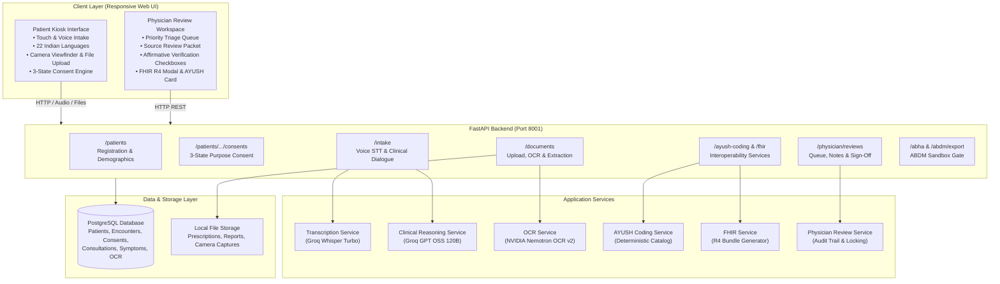

# MediKiosk

An AI-assisted, multilingual self-service clinical intake kiosk for hospital Outpatient Departments (OPD). It enables patients to record their symptoms and upload previous medical records before their consultation, while providing attending physicians with a structured, source-traceable review workspace.

[](https://www.sih.gov.in/)
[](https://fastapi.tiangolo.com/)
[](https://www.postgresql.org/)
[](tests/)
[](app/services/fhir_service.py)
[](app/services/ayush_coding_service.py)

---

## 1. Overview

In high-volume hospital Outpatient Departments (OPDs), physicians often have only a few minutes per consultation. Patients arrive with fragmented paper prescriptions, diverse language backgrounds, and unstructured symptoms. 

**MediKiosk** acts as a pre-consultation intake station placed at the hospital OPD entrance. It guides patients through identity lookup, purpose-specific consent, multilingual voice history-taking, and medical document digitization (via file upload or camera snapshot). The attending clinician then receives an organized clinical review packet with source-backed findings, unverified-state safeguards, emergency triage alerts, and interoperable FHIR/AYUSH representations.

```
Patient Arrival
  │
  ▼
[ 1. Identification ] ──► Lookup existing record or register demographics
  │
  ▼
[ 2. Consent Engine ] ──► 3-state granular consent per clinical purpose
  │
  ▼
[ 3. Voice Intake   ] ──► Sub-second transcription (Groq Whisper) & history taking (Groq GPT OSS 120B)
  │
  ▼
[ 4. Document Scan  ] ──► File upload or in-browser live camera viewfinder
  │
  ▼
[ 5. OCR & Extract  ] ──► NVIDIA Nemotron OCR v2 + structured lab/med extraction
  │
  ▼
[ 6. OPD Queue      ] ──► Monotonic emergency red-flag triage sorting (Urgent → Priority → Routine)
  │
  ▼
[ 7. Physician Desk ] ──► Source inspection, AYUSH dual-coding, FHIR R4 modal, notes, & audit sign-off
```

---

## 2. Problem

Indian public and tertiary hospital OPDs face significant operational hurdles:
- **Severe OPD Congestion**: Overcrowded waiting halls where clinicians spend a large fraction of consultation time on basic clerical history-taking.
- **Linguistic Diversity**: Patients often speak regional dialects or scheduled languages not shared fluently by rotating clinical staff.
- **Fragmented Paper Records**: Patients bring stacks of paper reports and handwritten prescriptions that cannot be queried or tracked chronologically.
- **Unstructured Pre-Triage**: Critical warning signs (e.g., acute chest pain, severe breathlessness) risk sitting unflagged in general waiting queues.
- **Interoperability Gaps**: Difficulty bridging modern FHIR standards and traditional Indian systems of medicine (AYUSH) into standard OPD workflows.

---

## 3. Solution

MediKiosk bridges the gap between patient arrival and physician consultation:
- **Self-Service Kiosk**: Touch and voice-driven interface accessible to patients with varying literacy levels.
- **Multilingual Architecture**: 22 Eighth Schedule Indian languages architecture (5 full UI languages + 17 speech-assisted languages).
- **Physical Document Digitization**: Dual-mode capture (drag-and-drop file upload or live camera viewfinder with framing guide).
- **Safety-First Emergency Triage**: Monotonic priority escalation (`urgent` $\rightarrow$ `priority` $\rightarrow$ `routine`) that bubbles acute red flags to the top of the doctor's queue.
- **Physician Authority**: Clear distinction between patient-reported facts and clinical sign-off. All automated findings remain flagged as `NOT PHYSICIAN VERIFIED` until an authorized clinician affirmatively checks them.
- **Dual-System Interoperability**: FHIR R4-compatible bundles alongside deterministic AYUSH NAMASTE and WHO ICD-11 Chapter 26 (TM2) dual-coding.

> **Core Clinical Principle**: *"AI assists; physician verifies."*

---

## 4. Core User Journey

### Patient Journey (Kiosk Station)
1. **Welcome & Language**: Select language (English, Hindi, Telugu, Tamil, Bengali, or 17 speech-assisted languages).
2. **Identification**: Enter Patient ID or register as a new outpatient (Name, Age, Gender, Phone, optional ABHA).
3. **Informed Consent**: Explicitly review and grant purpose-specific consents (clinical history, document OCR, extraction, summary, physician review, ABDM sharing).
4. **Voice History Intake**: Speak naturally via kiosk microphone. Review and confirm transcript before clinical AI processes it and generates adaptive follow-up inquiries.
5. **Document Scanner**: Upload past prescriptions/lab reports (PDF/JPG/PNG) or snap a photo using the live camera viewfinder.
6. **Summary Review & Submit**: Review the structured timeline and symptoms, then submit to the OPD review queue.

### Physician Journey (Consultation Workspace)
1. **Queue Inspection**: View incoming OPD consultations sorted by priority rank (`urgent`, `priority`, `routine`).
2. **Review Packet**: Inspect demographics, patient-reported symptoms, raw OCR text, and extracted lab values with reference range indicators.
3. **Interoperability Tools**: Inspect deterministic AYUSH NAMASTE & ICD-11 TM2 codes and open the interactive NRCES India FHIR R4 bundle modal.
4. **Clinical Verification**: Enter notes, check affirmative verification boxes for verified items, and complete sign-off (permanently locking the consultation).

---

## 5. Key Features

| Feature | Description | Implementation Status |
| :--- | :--- | :--- |
| **Patient Registration** | Create and retrieve outpatient demographics with unique IDs | Implemented & Verified |
| **22-Language Architecture** | 5 localized UI languages (`en`, `hi`, `te`, `ta`, `bn`) + 17 speech-assisted scheduled languages | Implemented |
| **Multilingual Voice Intake** | Browser MediaRecorder audio capture with transcript confirmation card | Implemented & Verified |
| **Speech-to-Text** | Low-latency audio transcription via Groq Whisper (`whisper-large-v3-turbo`) | Verified live |
| **Adaptive Clinical History** | Structured history-taking and empathetic follow-ups via Groq (`openai/gpt-oss-120b`) | Verified live |
| **Red-Flag Emergency Detection** | Detection of cardiac, respiratory, neurological, bleeding, and vertigo signals | Implemented & Tested |
| **Monotonic Queue Priority** | Priority only moves upward (`urgent` $\rightarrow$ `priority` $\rightarrow$ `routine`) and sorts queue | Implemented & Tested |
| **File Upload Scanner** | Multipart PDF, PNG, JPG upload with magic-byte validation & 10MB size limit | Implemented & Tested |
| **Camera Document Capture** | In-browser live camera viewfinder (`getUserMedia`) with alignment framing guide | Implemented |
| **Medical Document OCR** | Page rendering via `pypdfium2` and OCR via NVIDIA Nemotron OCR v2 | Implemented (Provider-dependent) |
| **Structured Medical Extraction** | Explicit extraction of lab observations, medications, and allergies from OCR text | Implemented & Tested |
| **Document Intelligence** | Reference range categorization (Normal/High/Low/Critical) and chronological timeline | Implemented & Tested |
| **AYUSH Dual-Coding** | Deterministic mapping to NAMASTE and WHO ICD-11 TM2 from controlled local catalog | Implemented & Tested |
| **Dashavidha Pariksha Context**| 10-fold Ayurvedic clinical examination framework contextualization | Implemented |
| **FHIR R4 Representation** | FHIR R4-compatible Bundle endpoint with interactive in-browser modal viewer | Implemented & Tested |
| **3-State Consent Engine** | Discrete `Not Granted`, `Active — Granted`, and `Revoked` states across 6 purpose scopes | Implemented & Tested |
| **ABHA Linking** | 14-digit ABHA validation, local storage, and database indexing | Implemented & Tested |
| **ABDM Sandbox Export** | Consent-gated sandbox export payload generation (`403 Forbidden` if revoked) | Sandbox-ready |
| **Physician Review Desk** | Triage queue, clinical review packet, clinical notes, and affirmative checkboxes | Implemented & Tested |
| **Audit & Sign-off Locking** | Consultation lock upon sign-off with reviewing clinician audit trail | Implemented & Tested |

---

## 6. System Architecture



### Layer Breakdown
- **Client Layer**: Single-page application written in vanilla HTML5, CSS3 custom properties, and ES6+ JavaScript. No third-party frontend frameworks required.
- **API Layer**: FastAPI asynchronous web framework handling validation, routing, file streaming, and authentication bounds.
- **Service Layer**: Decoupled domain services managing speech-to-text, clinical extraction, deterministic terminology mapping, FHIR serialization, and audit logging.
- **Data Layer**: PostgreSQL relational database with SQLAlchemy ORM (SQLite in-memory engine utilized during automated testing).

---

## 7. Technology Stack

| Layer | Component | Technology | Purpose |
| :--- | :--- | :--- | :--- |
| **Backend** | Framework | FastAPI 0.115+ | High-performance asynchronous REST API |
| | Data Validation | Pydantic v2 | Strict request/response schema enforcement |
| | ORM | SQLAlchemy 2.0+ | Relational data persistence & migrations |
| | Server | Uvicorn | ASGI web server |
| **AI / ML** | Speech-to-Text | Groq Whisper (`whisper-large-v3-turbo`) | Low-latency multilingual audio transcription |
| | Clinical Reasoning | Groq Cloud (`openai/gpt-oss-120b`) | Adaptive history-taking and JSON extraction |
| | Document Vision | NVIDIA Cloud (`nvidia/nemotron-ocr-v2`) | High-resolution medical document OCR |
| | PDF Rendering | PyMuPDF / `pypdfium2` | Rendering multi-page PDF documents into image buffers |
| **Frontend** | Core | HTML5, CSS3, ES6+ JavaScript | Zero-build responsive kiosk and physician dashboard |
| | Camera API | `navigator.mediaDevices.getUserMedia` | Native hardware camera viewfinder capture |
| | Audio API | `MediaRecorder` API | In-browser audio streaming |
| **Interoperability** | Traditional Medicine | AYUSH NAMASTE & WHO ICD-11 TM2 | Standardized Indian morbidity dual-coding |
| | Digital Health | HL7 FHIR R4 | Standardized clinical data bundles |
| | Identity | ABDM / ABHA | 14-digit Ayushman Bharat Health Account linking |
| **Testing** | Framework | Pytest 9+, AnyIO, TestClient | Automated unit and integration testing (94 tests) |

---

## 8. Project Structure

```
medikiosk-backend/
├── app/
│   ├── api/                     # FastAPI Route Controllers
│   │   ├── abdm.py              # ABHA linking and ABDM sandbox export
│   │   ├── clinical_summary.py  # Structured visit summary generation
│   │   ├── consent.py           # 3-state purpose-specific consent endpoints
│   │   ├── documents.py         # File upload, camera upload, OCR & extraction
│   │   ├── intake.py            # Audio transcription & clinical conversation
│   │   ├── patients.py          # Registration, AYUSH coding & FHIR R4 endpoints
│   │   └── physician_review.py  # Queue retrieval, notes, verification & sign-off
│   ├── db/
│   │   └── database.py          # SQLAlchemy engine, session maker & schema migration
│   ├── models/                  # SQLAlchemy Relational Models
│   │   ├── allergy.py           # Patient allergy records
│   │   ├── consent.py           # Purpose-specific consent grants & revocations
│   │   ├── consultation.py      # OPD review status, priority, and doctor notes
│   │   ├── document.py          # Uploaded document metadata and file paths
│   │   ├── encounter.py         # Clinical intake encounter sessions
│   │   ├── medication.py        # Active medications, dosage & frequency
│   │   ├── ocr_result.py        # Raw text and structured extraction results
│   │   ├── patient.py           # Demographics and ABHA identifiers
│   │   ├── physician_review_audit.py # Affirmative field verification audit trail
│   │   └── symptom.py           # Reported symptoms, duration & severity
│   ├── schemas/                 # Pydantic Schemas for Request/Response Validation
│   │   ├── ayush_coding.py      # NAMASTE and WHO ICD-11 TM2 schemas
│   │   ├── consent.py           # Purpose enum and grant/revoke models
│   │   ├── medical_extraction.py# Structured OCR observations, meds, allergies
│   │   ├── patient.py           # Patient creation and review item schemas
│   │   └── physician_review.py  # Review packet and verification models
│   ├── services/                # Core Business Logic & AI Integrations
│   │   ├── abdm_service.py      # ABDM sandbox payload packaging
│   │   ├── ai_service.py        # Groq GPT OSS 120B / NVIDIA LLM integration
│   │   ├── ayush_coding_service.py # Controlled local catalog dual-coding engine
│   │   ├── clinical_summary_service.py # Visit summary compilation
│   │   ├── consent_service.py   # Consent enforcement & state checking
│   │   ├── document_intelligence_service.py # Reference ranges & timeline
│   │   ├── fhir_service.py      # FHIR R4 collection bundle generator
│   │   ├── medical_extraction_service.py # Extraction from OCR text
│   │   ├── ocr_service.py       # PDF rendering & NVIDIA Nemotron OCR client
│   │   ├── physician_review_service.py # Review packet assembly & verification
│   │   └── transcription_service.py # Groq Whisper speech-to-text client
│   └── main.py                  # Application entrypoint, CORS, and static mount
├── frontend/                    # Single-Page Kiosk and Physician Web App
│   ├── app.js                   # Application state, i18n, voice, camera, & API calls
│   ├── index.html               # Responsive HTML layout and modal dialogues
│   └── styles.css               # Design system, responsive layout, accessible tokens
├── storage/                     # Uploaded documents and camera image captures
├── tests/                       # Automated Test Suite (94 passing tests)
│   ├── conftest.py              # In-memory SQLite fixtures and test client
│   ├── test_abdm.py             # ABHA and ABDM export tests
│   ├── test_ai_service.py       # Clinical AI conversation tests
│   ├── test_ayush_coding.py     # Deterministic AYUSH mapping tests
│   ├── test_clinical_summary.py # Clinical visit summary tests
│   ├── test_consent.py          # 3-state consent lifecycle tests
│   ├── test_document_intelligence.py # Range categorizations & timeline tests
│   ├── test_documents.py        # File validation and upload tests
│   ├── test_end_to_end.py       # Full synthetic patient lifecycle test
│   ├── test_fhir.py             # FHIR R4 bundle generation tests
│   ├── test_intake.py           # Intake dialogue and red flag tests
│   ├── test_medical_extraction.py # Structured OCR extraction tests
│   ├── test_ocr.py              # PDF rendering and OCR client tests
│   ├── test_patient_consultations.py # Consultation queue tests
│   ├── test_physician_review.py # Physician review and verification tests
│   ├── test_queue_priority.py   # Monotonic queue priority escalation tests
│   └── test_transcription.py    # Speech-to-text service tests
├── pytest.ini                   # Pytest configuration (targets tests directory)
├── requirements.txt             # Python package dependencies
├── .env.example                 # Example environment configuration template
└── README.md                    # Project documentation
```

---

## 9. Setup & Installation

### Windows (Tested Development Environment)

```powershell
# 1. Clone repository and navigate to root
git clone <repository-url>
cd medikiosk-backend

# 2. Create and activate Python virtual environment
python -m venv venv
.\venv\Scripts\Activate.ps1

# 3. Install dependencies
pip install -r requirements.txt
```

### Linux / macOS

```bash
# 1. Clone repository and navigate to root
git clone <repository-url>
cd medikiosk-backend

# 2. Create and activate virtual environment
python3 -m venv venv
source venv/bin/activate

# 3. Install dependencies
pip install -r requirements.txt
```

---

## 10. Environment Configuration

Create a `.env` file in the project root by copying the template.

> **IMPORTANT**: Never commit `.env` containing real keys to version control. The repository includes `.env` in `.gitignore`.

```dotenv
# Database (PostgreSQL)
DATABASE_URL=postgresql://<username>:<password>@localhost:5432/medikiosk

# Groq Cloud Clinical AI & Whisper Speech-to-Text
GROQ_API_KEY=gsk_your_groq_api_key_here
GROQ_BASE_URL=https://api.groq.com/openai/v1
GROQ_MODEL=openai/gpt-oss-120b
WHISPER_MODEL=whisper-large-v3-turbo

# NVIDIA Cloud Nemotron OCR v2
NVIDIA_OCR_API_KEY=nvapi-your_nvidia_ocr_key_here
NVIDIA_OCR_BASE_URL=https://ai.api.nvidia.com/v1/cv/nvidia/nemotron-ocr-v2
NVIDIA_OCR_MODEL=nvidia/nemotron-ocr-v2

# Optional Fallback Settings
NVIDIA_API_KEY=
NVIDIA_BASE_URL=https://integrate.api.nvidia.com/v1
NVIDIA_MODEL=nvidia/nemotron-3-ultra-550b-a55b

# ABDM Sandbox Settings
ABDM_SANDBOX_MODE=true
```

---

## 11. Running the Application

```powershell
# Start FastAPI application using Uvicorn
uvicorn app.main:app --reload --port 8001
```

Once started, access the application at:
- **Patient Kiosk & Physician Dashboard**: [http://127.0.0.1:8001/kiosk/](http://127.0.0.1:8001/kiosk/)
- **Interactive Swagger Documentation**: [http://127.0.0.1:8001/docs](http://127.0.0.1:8001/docs)
- **Alternative ReDoc Documentation**: [http://127.0.0.1:8001/redoc](http://127.0.0.1:8001/redoc)

---

## 12. Frontend / Kiosk

The frontend is served directly by FastAPI from `frontend/` as a zero-build client:
- **Patient Kiosk View**:
  - Full touch-friendly design suitable for physical kiosk touchscreens.
  - In-browser microphone recording with a transcript confirmation card before submission.
  - Native document camera viewfinder (`navigator.mediaDevices.getUserMedia`) with alignment framing guide.
  - Explicit purpose-by-purpose consent card.
- **Physician Review Workspace**:
  - Live OPD consultation queue with triage priority badges (`URGENT`, `PRIORITY`, `ROUTINE`).
  - Source-backed review packet displaying patient history, raw OCR text, and extracted lab results.
  - AYUSH dual-coding inspection card with Dashavidha Pariksha context.
  - Interactive NRCES India FHIR R4 Bundle modal with resource chips, syntax viewer, copy, and JSON download.
  - Doctor notes text editor, affirmative verification checkboxes, and sign-off locking.
- **Multilingual Architecture**:
  - **Tier 1 (Fully Localized UI + Voice)**: English (`en`), Hindi (`hi`), Telugu (`te`), Tamil (`ta`), Bengali (`bn`). Complete translated interface dictionary (`I18N` table in `frontend/app.js`).
  - **Tier 2 (Speech-Assisted Scheduled Languages)**: Marathi (`mr`), Gujarati (`gu`), Kannada (`kn`), Malayalam (`ml`), Odia (`or`), Punjabi (`pa`), Assamese (`as`), Urdu (`ur`), Sanskrit (`sa`), Maithili (`mai`), Santali (`sat`), Kashmiri (`ks`), Nepali (`ne`), Sindhi (`sd`), Konkani (`kok`), Dogri (`doi`), Bodo (`brx`), Manipuri (`mni`). Audio speech is transcribed into the intake flow via multilingual Whisper.

---

## 13. API Overview

### Patient Registration & Demographics
| Method | Endpoint | Description |
| :--- | :--- | :--- |
| `POST` | `/patients/` | Register a new patient (Name, Age, Gender, Language, Phone, ABHA) |
| `GET` | `/patients/{patient_id}` | Retrieve patient demographic record |

### Purpose-Specific Consent Engine (3-State)
| Method | Endpoint | Description |
| :--- | :--- | :--- |
| `POST` | `/patients/{patient_id}/consents` | Grant consent for a specific purpose (`action: "grant"`) |
| `GET` | `/patients/{patient_id}/consents` | List full consent audit history for the patient |
| `GET` | `/patients/{patient_id}/consents/check` | Check if active consent exists for a query parameter purpose |
| `POST` | `/patients/{patient_id}/consents/{consent_id}/revoke` | Revoke an active consent purpose (`action: "revoke"`) |

### Clinical Intake & Voice Processing
| Method | Endpoint | Description |
| :--- | :--- | :--- |
| `POST` | `/intake/start` | Initialize clinical intake; returns localized greeting |
| `POST` | `/intake/transcribe` | Transcribe browser audio bytes via Groq Whisper Turbo |
| `POST` | `/intake/message` | Submit confirmed patient response; triggers clinical AI reasoning |
| `POST` | `/intake/{encounter_id}/terminate` | Terminate an active clinical intake encounter |

### Physical Documents, Camera & OCR Intelligence
| Method | Endpoint | Description |
| :--- | :--- | :--- |
| `POST` | `/documents/upload` | Upload PDF or image file (magic bytes & size validated, max 10MB) |
| `GET` | `/documents/{document_id}` | Get document metadata and OCR processing status |
| `GET` | `/documents/{document_id}/file` | Download stored original document file |
| `POST` | `/documents/{document_id}/ocr` | Run NVIDIA Nemotron OCR v2 on document pages |
| `GET` | `/documents/{document_id}/ocr` | Retrieve stored OCR text and detection bounding elements |
| `POST` | `/documents/{document_id}/extract` | Extract structured observations, meds, and allergies from OCR text |
| `GET` | `/documents/{document_id}/intelligence` | Compile chronological timeline and reference range highlights |
| `GET` | `/patients/{patient_id}/clinical-summary` | Compile structured clinical visit summary |

### Interoperability: AYUSH Dual-Coding & FHIR R4
| Method | Endpoint | Description |
| :--- | :--- | :--- |
| `GET` | `/patients/{patient_id}/ayush-coding` | Retrieve deterministic AYUSH NAMASTE & WHO ICD-11 TM2 dual-codes |
| `GET` | `/patients/{patient_id}/fhir` | Generate FHIR R4-compatible Bundle for patient encounter |

### ABDM / ABHA Sandbox Gate
| Method | Endpoint | Description |
| :--- | :--- | :--- |
| `PUT` | `/patients/{patient_id}/abha` | Link and normalize 14-digit ABHA number locally |
| `POST` | `/patients/{patient_id}/abdm/export` | Generate ABDM sandbox export bundle (requires `abdm_sharing` consent) |

### Physician Review Workspace & Sign-Off
| Method | Endpoint | Description |
| :--- | :--- | :--- |
| `POST` | `/patients/{patient_id}/consultations` | Queue an intake encounter for physician review |
| `GET` | `/patients/physician/reviews` | Retrieve OPD consultation queue sorted by priority rank |
| `GET` | `/patients/{patient_id}/physician-review-packet` | Retrieve source-backed review packet (demographics, OCR, AYUSH, flags) |
| `POST` | `.../consultations/{cid}/review/notes` | Save attending physician clinical notes (`in_review` status) |
| `POST` | `.../consultations/{cid}/review/verify` | Record affirmative physician field verification (`verified` status) |
| `POST` | `.../consultations/{cid}/review/complete` | Complete sign-off audit and lock consultation record (`completed` status) |

---

## 14. AI / OCR Pipeline

```
Patient Audio ──► /intake/transcribe ──► Groq Whisper Turbo ──► Patient Review Card ──► Confirmed Text
                                                                                             │
                                                                                             ▼
                                  Groq GPT OSS 120B ◄── Conversation Context ◄── /intake/message
                                          │
                  ┌───────────────────────┴────────────────────────┐
                  ▼                                                ▼
       Next Clinical Question                             Extracted Symptoms & Red Flags
```

```
Paper Report / Camera ──► /documents/upload ──► Magic-Byte Validation (Max 10MB)
                                                        │
                                                        ▼
                                             pypdfium2 PDF Rendering
                                                        │
                                                        ▼
                                             NVIDIA Nemotron OCR v2
                                                        │
                                                        ▼
                                        Structured Medical Extraction
                                 (Observations, Reference Ranges, Meds, Allergies)
```

### Live Provider Status

| Component | Configured Provider & Model | Live Status | Failure Fallback |
| :--- | :--- | :--- | :--- |
| **Speech-to-Text** | Groq Cloud (`whisper-large-v3-turbo`) | Verified Live | User can type responses into text input |
| **Clinical Reasoning** | Groq Cloud (`openai/gpt-oss-120b`) | Verified Live | Fallback to NVIDIA LLM or graceful error message |
| **Document Vision** | NVIDIA Cloud (`nvidia/nemotron-ocr-v2`) | Reachable (Provider-dependent) | File stored safely; manual review available |
| **ABDM Integration** | Local ABDM Sandbox Gate | Sandbox-ready | Operates locally without external sandbox dependency |

*Graceful Degradation*: If an AI service times out or becomes unreachable, the backend catches the upstream exception, preserves all previously entered data, and allows manual data entry or retry without crashing.

---

## 15. Consent & Privacy

MediKiosk implements a purpose-specific consent engine adhering to the principles of India's Digital Personal Data Protection (DPDP) Act and ABDM consent architecture.

### The 3 Discrete States
1. **`Not Granted`**: Initial state; data collection for this purpose is blocked.
2. **`Active — Granted`**: Explicitly granted by patient with timestamp and version.
3. **`Revoked`**: Explicitly revoked by patient. Can be re-granted at any time.

### The 6 Purpose Scopes Implemented in Code
1. `clinical_history`: Guided conversational history taking and symptom recording.
2. `document_processing`: Storing and performing optical character recognition on uploaded files.
3. `document_extraction`: Extracting structured laboratory observations, medications, and allergies.
4. `clinical_summary`: Compiling collected clinical facts into a visit summary.
5. `physician_review`: Storing and displaying the pre-consultation packet in the physician workspace.
6. `abdm_sharing`: Sharing consultation data with the Ayushman Bharat Digital Mission.

> **ABDM Consent Gating**: ABDM sharing is strictly separated from in-clinic care. Attempting to generate an ABDM export bundle without active `abdm_sharing` consent returns `403 Forbidden`.

---

## 16. Physician Review & Emergency Triage

To prevent unvetted AI suggestions from entering legal patient records, MediKiosk enforces strict human-in-the-loop clinical boundaries:

```
[ Pending ] ────► [ In Review ] ────► [ Verified ] ────► [ Completed (Locked) ]
  In queue          Doctor adds notes   Affirmative check   Record finalized & audit
```

- **Unvarnished Source Display**: The review packet shows exactly what the patient stated, raw OCR text, and extracted lab values with their original source citations.
- **Explicit Unverified Warnings**: Every AI-generated finding carries a prominent `NOT PHYSICIAN VERIFIED` notice.
- **Affirmative Verification**: Clinicians must explicitly click verification checkboxes for each symptom, medication, and allergy to mark it `physician_verified: true`.
- **Tamper-Evident Sign-Off Locking**: Completing review locks the consultation against subsequent edits and records the reviewing doctor ID and completion timestamp.

### Monotonic Emergency Red-Flag Triage
MediKiosk includes a deterministic and pattern-based emergency triage scanner designed to route high-risk patients immediately to clinical attention:
- **Monotonic Priority Escalation**: Encounter priority can only escalate upwards (`urgent` $\rightarrow$ `priority` $\rightarrow$ `routine`) and will **never** automatically de-escalate.
- **Detected Clinical Signals**:
  - Acute chest pain, crushing chest pressure, or potential cardiac distress.
  - Severe respiratory distress, breathlessness, or inability to breathe.
  - Loss of consciousness, syncope, fainting, or seizure events.
  - Severe or uncontrolled bleeding / hemorrhage.
  - Acute neurological weakness, sudden numbness, or stroke signs.
  - Severe acute dizziness.
- **Queue Bubbling**: Encounters flagged as `urgent` are assigned a priority rank of `1` in the database query, bubbling them above routine cases in the doctor's OPD list with visual red warning badges.

> **Safety Notice**: Red-flag triage is an operational queue-prioritization safeguard, not a clinical diagnosis. The system directs patients with emergency symptoms to immediate hospital staff attention.

---

## 17. ABHA / ABDM Sandbox Integration

MediKiosk provides the foundational components required for the Ayushman Bharat Digital Mission (ABDM):

- **14-Digit ABHA Linking**: Endpoints validate, normalize, and index 14-digit ABHA numbers against patient records (`PUT /patients/{id}/abha`).
- **Sandbox Export Bundle**: Generates an ABDM-compliant export bundle containing the patient's verified clinical summary, symptoms, and digitized document references (`POST /patients/{id}/abdm/export`).
- **Strict Purpose Gating**: ABDM export requires explicit `abdm_sharing` consent. If consent is revoked or ungranted, the endpoint strictly returns `403 Forbidden`.
- **Local Sandbox Execution**: The ABDM module operates locally in sandbox mode without requiring live external gateway credentials for prototype evaluation.

---

## 18. FHIR / AYUSH Interoperability

### AYUSH Dual-Coding (NAMASTE + WHO ICD-11 TM2)
To support India's integrated healthcare vision, MediKiosk provides dual-coding for traditional medicine:
- **Deterministic Mapping**: Maps symptoms to National AYUSH Morbidity Codes (NAMC) and WHO ICD-11 Chapter 26 Traditional Medicine Module 2 (TM2) codes.
- **Controlled Local Catalog**: Driven by a curated local mapping catalog of 13 major clinical morbidity concepts (Fever/Jvara, Low Back Pain/Katishula, Osteoarthritis/Sandhivata, Acidity/Amlapitta, Asthma/Tamaka Shwasa, Diabetes/Madhumeha, Hypertension/Raktachapa, etc.).
- **Zero Hallucination**: Unmapped terms remain explicitly unmapped (`coding_status: "unmapped"`). The system never invents or guesses clinical codes.
- **Dashavidha Pariksha Context**: Formats the 10-fold Ayurvedic clinical examination framework (*Prakriti, Vikriti, Sara, Samhanana, Pramana, Satmya, Satva, Aharashakti, Vyayamashakti, Vaya*) for Vaidya review.

### FHIR R4-Compatible Representation
MediKiosk implements a prototype FHIR R4 Bundle generator (`GET /patients/{id}/fhir`) structured for Indian interoperability workflows:
- **Resource Types**: Packages `Patient`, `Encounter`, `Condition` (with unconfirmed clinical status), `Observation` (lab findings, reference ranges, interpretation), `MedicationStatement`, and `AllergyIntolerance`.
- **Interactive UI Modal**: Allows clinicians to inspect resource count chips, view formatted JSON, copy to clipboard, or download the `.json` bundle file.

---

## 19. Testing & Verification

The codebase includes an automated test suite of **94 passing tests** across 16 test modules:

```powershell
# Run the full test suite using pytest
$env:PYTHONPATH="."
pytest
```

```
============================== test session starts ==============================
rootdir: D:\medikiosk-backend, configfile: pytest.ini, testpaths: tests
collected 94 items

tests\test_abdm.py ........                                              [  8%]
tests\test_ai_service.py ......                                          [ 14%]
tests\test_ayush_coding.py ...                                           [ 18%]
tests\test_clinical_summary.py ..........                                [ 28%]
tests\test_consent.py .......                                            [ 36%]
tests\test_document_intelligence.py ......                               [ 42%]
tests\test_documents.py ......                                           [ 48%]
tests\test_end_to_end.py .                                               [ 50%]
tests\test_fhir.py ..                                                    [ 52%]
tests\test_intake.py ......                                              [ 58%]
tests\test_medical_extraction.py ..........                              [ 69%]
tests\test_ocr.py ...............                                        [ 85%]
tests\test_patient_consultations.py ..                                   [ 87%]
tests\test_physician_review.py ....                                      [ 91%]
tests\test_queue_priority.py ...                                         [ 94%]
tests\test_transcription.py .....                                        [100%]

======================== 94 passed, 1 warning in 4.05s ========================
```

### Verification Methodology
- **Isolated Database Fixtures**: Tests execute against an in-memory SQLite database (`StaticPool`) to guarantee independence from local PostgreSQL state.
- **Live Provider Testing**: Live API probe scripts verify external Groq Whisper transcription and Groq GPT OSS 120B reasoning against active endpoints.
- **End-to-End Synthetic Journey**: `test_end_to_end.py` executes a complete synthetic patient journey from registration through consent, intake, document upload, OCR extraction, priority triage, and physician sign-off.

---

## 20. Known Limitations

To maintain transparency as an engineering prototype:
- **Prototype ABDM Sandbox**: The ABDM module produces valid sandbox export bundles, but live production HIE-CM bridge integration requires institutional production credentials from NHA.
- **Speech Quality**: Speech-to-text accuracy depends on ambient kiosk microphone quality and hospital noise levels.
- **Handwritten Doctor Scripts**: NVIDIA Nemotron OCR v2 performs well on printed laboratory test reports, but highly stylized cursive handwritten prescriptions remain challenging for automated OCR.
- **Language Localization Tiers**: 5 primary languages feature full localized UI dictionaries; the remaining 17 languages operate via speech-assisted intake.
- **Controlled AYUSH Scope**: AYUSH dual-coding is driven by a controlled prototype catalog of 13 core concepts, rather than the exhaustive thousands of terms in the complete NAMASTE portal.
- **Interoperability Prototype**: FHIR R4 bundles are structured according to Indian guidelines but have not undergone formal government agency certification.
- **Non-Diagnostic**: MediKiosk does not have medical device certification; it serves solely as an administrative pre-consultation intake assistant.

---

## 21. Demo Walkthrough

### 3-Minute Hackathon Demonstration Script

#### Patient Kiosk Flow
1. **Language**: Open [http://127.0.0.1:8001/kiosk/](http://127.0.0.1:8001/kiosk/) and choose Hindi or Telugu. Notice the UI translates dynamically.
2. **Register**: Click "Check In" and create a test patient (e.g., Ramesh, 45, Male).
3. **Consent**: On the consent screen, click "Grant Consent" on the intake purposes. Leave ABDM ungranted to demonstrate purpose separation.
4. **Voice Intake**: Click the microphone button and speak: *"I have had severe chest pain and breathlessness since morning."*
5. **Transcript Confirmation**: Review the transcribed text card and confirm.
6. **Adaptive AI**: Groq GPT OSS 120B immediately triggers a red-flag safety alert and asks a clarifying question about pain radiation.
7. **Document Scan**: Switch to the Document tab. Choose "Camera Capture" to view the live camera alignment box, or upload a sample lab report image.
8. **Submit**: Review the extracted visit summary and submit to the OPD queue.

#### Physician Review Flow
1. **Queue Inspection**: Open the Physician Desk. Notice Ramesh is bubbled to the top with an `URGENT` red badge and red-flag reasoning.
2. **Review Packet**: Open the consultation. Inspect the unvarnished patient history, raw OCR text, and extracted lab table.
3. **AYUSH & FHIR**: View the AYUSH dual-coding card (Chest pain / Hridshula) and click **"View FHIR R4 Bundle"** to inspect the live JSON modal.
4. **Verification**: Enter attending notes (e.g., *"ECG ordered immediately"*), check affirmative verification boxes, and click **"Complete Review & Sign Off"**.
5. **Tamper Locking**: Notice the consultation locks immediately with a recorded timestamp and doctor ID.

---

## 22. Future Scope

- **Edge Whisper & SLM Deployment**: Running quantized Whisper and on-device Small Language Models (e.g., Gemma 2B) locally on kiosk hardware for rural Primary Health Centres (PHCs) with intermittent internet.
- **Specialized Handwriting OCR**: Fine-tuning vision-language models on Indian doctor handwriting and regional prescription formats.
- **Production ABDM Milestone M1/M2/M3**: Full integration with National Health Authority (NHA) live gateway APIs for automated health record linking.
- **Expanded AYUSH Terminology**: Ingesting the complete Ministry of AYUSH NAMASTE portal database across Ayurveda, Siddha, Unani, and Homeopathy.

---

## 23. Security & Safety Notes

- **Credential Containment**: All AI provider API keys, database credentials, and service tokens reside strictly on the server in environment variables. No secrets are ever exposed to the client browser.
- **Strict File Upload Validation**: The document upload pipeline verifies file extensions, validates binary magic bytes, enforces a 10MB limit, and uses sanitized filenames to prevent directory traversal.
- **Consent Enforcement Gate**: ABDM exports and clinical data processing verify active purpose-specific consent before execution (`403 Forbidden` on revoked consent).
- **Consultation Tamper-Evident Locking**: Finalized consultations are locked in the database, preventing subsequent manipulation of clinical records.
- **Audit Traceability**: All physician verification actions and sign-offs record reviewer identifiers and UTC timestamps.

---

## 24. Attribution & Hackathon Details

- **Event**: Smart India Hackathon (SIH) 2026
- **Project**: MediKiosk — Smart Patient Caretaking & Clinical Intake Platform
- **Repository**: [vemagirijoshith/medikiosk-backend](file:///d:/medikiosk-backend)
- **License**: Prototype developed for academic, evaluation, and hackathon presentation purposes.
